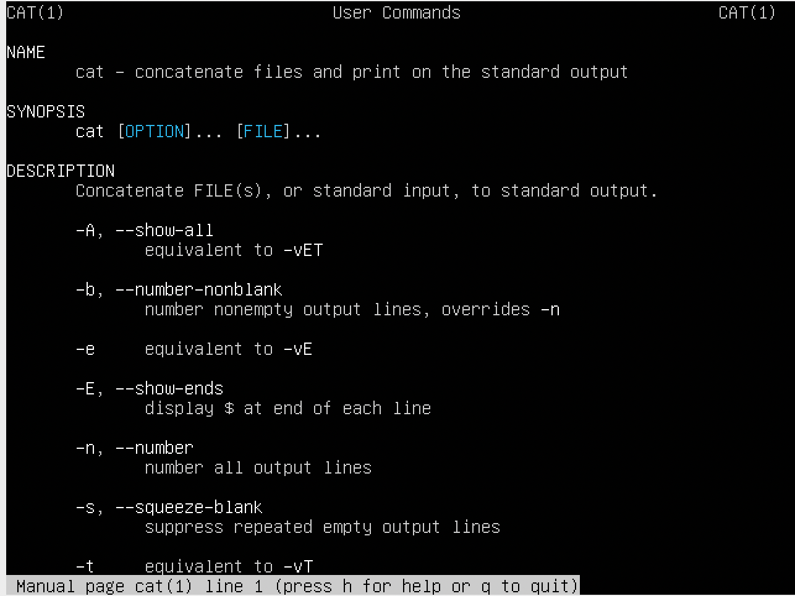

> **WARNING**: All task was made on Ubuntu
# Task 1
## Part 1

1. Log in to the system as root with help of command:
```
sudo su
```
2. Change root password using command
```
passwd
```  
This command change system file /etc/shadow

3. To determine all users with command
```
cat /etc/passwd
```
The /etc/passwd file stores essential information required during login. In other words, it stores user account information. The /etc/passwd is a plain text file. It contains a list of the system’s accounts, giving for each account some useful information like user ID, group ID, home directory, shell, and more. The /etc/passwd file should have general read permission as many command utilities use it to map user IDs to user names.
4. To change user information use command
```
usermod [options] LOGIN
```
The usermod command modifies the system account files to reflect
the changes that are specified on the command line.
>  -c, --comment **COMMENT**
  <br /> This label add comment for current user <br />
> -l, --login **NEW_LOGIN**
<br /> This label change login of user

  To change personal information it's command
```
chfn
```


5. Command **help**, **man** and **info**
* **Help** it's a command shows brief reference for embedded Linux commands

 

* **Man** this command consist extensive information about using linux command

 

 

* **Info** is the same as man, but it gives more detailed information

  

  

  For example, using command ```man``` let's learn command ```cat```

  ```
  man cat
  ```

  

6. View the content of file .bash* using command
  ```
  cat .bash*
  ```
  

  

7. Command ```finger``` shows info about users who logged in and information about them

  

  To change plan the ```.plan``` file was created with all necessary info

8. To look the contents of the home directory use ```ls```

  

## Part 2

1. Command ```tree``` shows content of directory tree structure

  

  In order to find certain file in folder use command
```
tree | grep [value]
```
For example, find all files that contain a value [ host ]

  

2. To know type of file use command
```
file [filename]
```


3. Relative path are used relative to the current directory


  Absolute path are used to navigation to necessary file from any point in file system
  

4. Command ```ls``` shows all files of directory
```
ls -la
```
Shows all files together with hidden and permissions

  

5. Implementation of 5 exercise

  

6. Implementation of 6 exercise
  

  * Softlink it's just label to file
  * Hardlink it's full duplicate file to which it refers, when the main file will be changed hardlink also will be changed
  
